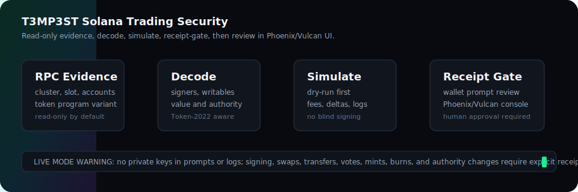

# T3MP3ST Solana

T3MP3ST is now adapted as a Solana-native multi-agent harness for on-chain
trading-security review, read-only RPC evidence, transaction decoding,
local/testnet simulation planning, x402-aware service gates, and defensive
agent operations.

<p align="center">
  
</p>

The package still exposes the historical `t3mp3st` and `tempest` CLI names for
compatibility, but the default domain model is Solana-first: programs, accounts,
mints, wallets, RPC endpoints, transaction intents, signer boundaries, PDA/CPI
surfaces, SPL Token, Token-2022, and simulation-before-signing gates.

## What Changed In This Pass

- Reframed the docs as a Solana trading-security command center:
  read-only RPC evidence, transaction decoding, route review, quote drift,
  wallet-prompt safety, simulation gates, and receipt-required signing.
- Rebuilt the docs homepage at [docs/index.html](docs/index.html) with a Solana
  trading dashboard, risk gates, and links into the new operating model.
- Replaced legacy benchmark/security pages with trading-specific references:
  [AI red-team techniques](docs/AI_REDTEAM_TECHNIQUES.md), [simulation bench](docs/CYBENCH.md),
  [wall forensics](docs/WALL_FORENSICS.md), [integrity ledger](docs/INTEGRITY_LEDGER.md),
  and [baseline rules](docs/XBOW_BASELINE.md).
- Updated the companion Phoenix perpetuals terminal UI in
  `/Users/8bit/Perp-Dex-Trading-Bot-main/src/ui` so the strategy selector and
  Trend/Maker/Offset Maker dashboards use Phoenix, Vulcan, Solana, paper/live
  mode, FIFO order book, account risk, and receipt-gate language.
- Mapped the Phoenix documentation index into the README so operators can jump
  from T3MP3ST review gates to Vulcan CLI setup, strategy loops, Phoenix risk
  pages, and Rise SDK integration docs.
- Preserved the safety floor: no private keys or seed phrases, no autonomous
  swaps/transfers/votes/mints/burns/authority changes, no market manipulation,
  and no buy/sell/hold advice.

## Phoenix/Vulcan Companion Workflow

Phoenix perpetual futures are live Solana mainnet markets. Vulcan is the
agent- and human-friendly CLI surface for Phoenix, with structured JSON output,
strategy runners, and a local MCP server. Treat it as a companion operator tool,
not as an unguarded execution backend.

Use T3MP3ST for review gates:

1. Scope the market, wallet, trader account, RPC endpoint, and action class.
2. Read market/account state and decode transaction intent.
3. Require paper mode or local/devnet fixtures for agent rehearsal.
4. Require simulation and human receipts before live signing or value movement.
5. Attach command output, transaction signatures, fills, funding, and PnL to
   evidence only after redaction.

Install and verify Vulcan separately:

```bash
curl -fsSL https://github.com/Ellipsis-Labs/vulcan-cli/releases/latest/download/install.sh | sh
vulcan version
vulcan setup
vulcan status -o json
```

Agent-safe defaults:

```bash
vulcan mcp
vulcan agent install --target codex
vulcan agent health
vulcan agent mcp diagnose --target codex --scope user
```

Live-capable mode is intentionally explicit:

```bash
export VULCAN_WALLET_NAME=my-wallet
export VULCAN_WALLET_PASSWORD=your-password
vulcan mcp --allow-dangerous
```

Do not put live-capable MCP config behind unattended agent access unless wallet
permissions, paper/live mode, confirmations, receipts, and operator monitoring
are all in place.

Phoenix docs to keep beside the console:

- [Vulcan CLI](https://docs.phoenix.trade/cli/index.md)
- [Vulcan installation](https://docs.phoenix.trade/cli/installation.md)
- [Vulcan command reference](https://docs.phoenix.trade/cli/commands.md)
- [Vulcan strategies](https://docs.phoenix.trade/cli/strategies.md)
- [Phoenix account health](https://docs.phoenix.trade/phoenix/margin-and-risk/account-health.md)
- [Phoenix order types](https://docs.phoenix.trade/phoenix/matching-engine/order-types.md)
- [Phoenix FIFO order book](https://docs.phoenix.trade/phoenix/matching-engine/fifo-order-book.md)
- [Rise SDK orders](https://docs.phoenix.trade/sdk/orders.md)
- [Phoenix REST/WebSocket best practices](https://docs.phoenix.trade/sdk/ws-api-best-practices.md)

## Safety Floor

Read these first:

- [three-laws.md](three-laws.md)
- [CONSTITUTION.md](CONSTITUTION.md)
- [CLAWD.md](CLAWD.md)
- [docs/SOLANA_NATIVE.md](docs/SOLANA_NATIVE.md)

Default posture is read-only. The harness does not need private keys or seed
phrases. It does not sign, submit, trade, launch, vote, transfer, or move value
without explicit human receipts and a prior simulation plan.

## What Ships

- Solana target types:
  - `solana_program`
  - `solana_account`
  - `solana_token`
  - `solana_wallet`
  - `solana_validator`
  - `solana_rpc`
  - `solana_transaction`
- Solana helpers:
  - public-key validation
  - cluster normalization
  - explorer links
  - Solana target factories
  - deterministic receipt hashes
  - read-only JSON-RPC helper
- Arsenal tools:
  - `solana_address_validate`
  - `solana_rpc_health`
  - `solana_account_lookup`
  - `solana_program_audit_plan`
  - `solana_transaction_dry_run_plan`
- Planning/runtime routing:
  - `solana_onchain` mission family
  - Solana workflow preset
  - Solana prompt pack
  - Solana runbook
  - Solana resource packs
  - RoE gates for signing, value movement, authority changes, and governance
- Catalog-only Solana tools:
  - Solana CLI
  - SPL Token CLI
  - Anchor CLI
  - Codama
  - LiteSVM
  - Surfpool

The catalog-only tools are intentionally not generic executable adapters yet.
They can submit transactions or depend on project-local harnesses, so they stay
documented until narrow no-submit templates are implemented.

## Quick Start

```bash
npm install
npm run typecheck
npm run test:solana
npm test
```

Start the local API and War Room:

```bash
npm run server
# UI: http://127.0.0.1:3333/ui/
```

Solana defaults:

```bash
export T3MP3ST_SOLANA_CLUSTER=devnet
export T3MP3ST_SOLANA_RPC_URL=https://api.devnet.solana.com
export T3MP3ST_SOLANA_WS_URL=wss://api.devnet.solana.com
export T3MP3ST_SOLANA_COMMITMENT=confirmed
```

## Library Example

```ts
import {
  createSolanaProgramTarget,
  createSolanaMissionReceipt,
  isSolanaAddress,
} from 't3mp3st';

const programId = '11111111111111111111111111111111';

if (isSolanaAddress(programId)) {
  const target = createSolanaProgramTarget(programId, 'devnet');
  const receipt = createSolanaMissionReceipt({
    missionId: 'mission-solana-review',
    action: 'read-only-program-review',
    target: target.address,
    reason: 'Scope-approved read-only Solana review',
  });
  console.log(target, receipt);
}
```

## Review Flow

1. Confirm written authorization, cluster, RPC endpoint, and public-key scope.
2. Validate addresses and classify program/account/mint/wallet/RPC targets.
3. Read account metadata without copying raw account data into evidence.
4. Review local Anchor/Pinocchio/native source or IDL when available.
5. Generate the Solana audit route: signers, writable accounts, PDAs, CPIs,
   token authorities, Token-2022 extensions, compute budget, priority fees.
6. Build a dry-run plan before any state-changing hypothesis.
7. Simulate locally/devnet and capture logs, account diffs, units consumed, and
   falsifiers.
8. Require a human receipt before any wallet prompt or irreversible action.

## Development Notes

Preferred stack for future Solana expansion:

- `@solana/kit` for new client/RPC/transaction code.
- Wallet Standard and framework-kit patterns for UI wallet discovery.
- Anchor for normal program iteration; Pinocchio for compute-sensitive programs.
- Codama for typed client generation.
- LiteSVM/Mollusk for fast tests; Surfpool for realistic cluster-state tests.

## Authorized Use

Use this only on assets you own or have explicit permission to assess. Mainnet
operations are read-only unless a mission contract and approval receipt say
otherwise. Never provide private keys or seed phrases to the harness.

## License

AGPL-3.0-or-later. See [LICENSE](LICENSE).
